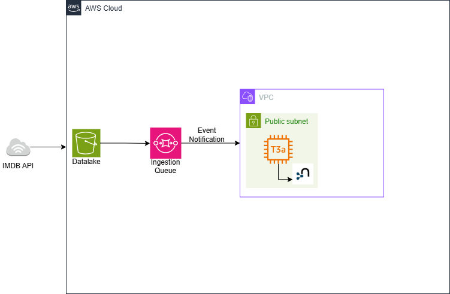

# AWS-Based Business Architechture
## Universidad de Las Palmas de Gran Canaria
### School of Computer Engineering
#### Bachelor's Degree in Data Science and Engineering 
##### Technology Services for Data Science
---
## Description

This project implements an AWS-based enterprise data platform designed following an event-driven and loosely coupled architecture. The system simulates a real-world business data pipeline where data is ingested, stored, processed, and consumed by different components in an asynchronous and scalable manner.

The platform acts as a **movie recommendation system**. It retrieves movie-related data from the **IMDb public API**, processes and enriches this information, and stores it in a graph-based Datamart. The final goal of the system is to provide personalized movie recommendations to end users based on their preferences and interactions.

The architecture is composed of independent modules that communicate through cloud-managed services, allowing each component to evolve, scale, and fail independently. Amazon Web Services (AWS) is used as the underlying infrastructure provider, leveraging managed services such as Amazon S3, Amazon SQS, Amazon EC2, and Neo4j as the analytical data store.

At a high level, the platform follows this workflow:

- A data ingestion module (Crawler) connects to the IMDb API and retrieves raw movie data.
- The ingested data is stored in an Amazon S3 bucket, acting as a Data Lake.
- Once the data is successfully stored, an event containing the S3 object location is published to an Amazon SQS queue.
- A long-running consumer module (Datamart Listener) continuously listens to the queue.
- When a new event is received, the consumer dynamically reads the referenced data from the Data Lake and processes it.
- The processed data is then inserted into a Neo4j graph database, which represents the Datamart layer.
- An API module exposes the Datamart to end users, allowing them to interact with the system and obtain movie recommendations based on their tastes.

Each module is implemented as an independent service and communicates exclusively through well-defined interfaces and cloud services, ensuring high cohesion and low coupling. This design reflects common architectural patterns used in enterprise-grade, cloud-native data platforms.

### Execution
--- 
## Architecture Overview

The following diagram presents a high-level view of the system architecture and execution flow. It illustrates how the different modules interact through AWS-managed services, following an event-driven approach.

--- 

## Resources

This project is entirely developed in **Java**, following a modular and layered design that promotes separation of concerns and maintainability. Each module is built as an independent Java application, responsible for a specific role within the overall architecture.

The platform relies on several **AWS cloud services** to implement a scalable, reliable, and event-driven data pipeline:

- **Amazon S3**  
  Used as the Data Lake layer, where raw and intermediate data is stored. Each ingestion process writes data to a structured path within the bucket, enabling versioning and traceability of executions.

- **Amazon SQS (Simple Queue Service)**  
  Acts as the asynchronous communication mechanism between the ingestion (Crawler) and processing (Datamart) modules. Events published to the queue contain metadata describing the location of newly ingested data in S3.

- **Amazon EC2**  
  Hosts the Neo4j graph database instance used as the Datamart layer. This allows full control over the database configuration while running in a cloud environment.

- **Neo4j**  
  Serves as the analytical data store, enabling graph-based modeling and querying of the processed data.

- **AWS SDK for Java**  
  Used by the application modules to interact programmatically with AWS services such as S3 and SQS.

In addition, the infrastructure of the platform is provisioned using **Terraform**, following the Infrastructure as Code (IaC) paradigm. Terraform is used to declaratively define and manage cloud resources such as EC2 instances, S3 buckets, and SQS queues, ensuring reproducibility, consistency, and ease of deployment across environments.
