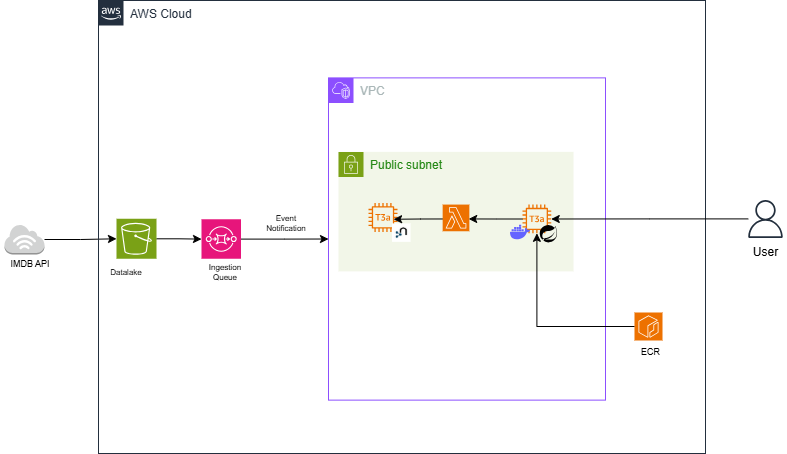

# AWS-Based Movie Data Platform & Recommendation System

## Universidad de Las Palmas de Gran Canaria
### School of Computer Engineering
#### Bachelor's Degree in Data Science and Engineering 
##### Technology Services for Data Science

---

## Description

This project implements an AWS-based enterprise data platform designed following an **event-driven and loosely coupled architecture**. The system simulates a real-world business data pipeline where data is ingested, stored, processed, and consumed asynchronously.

The platform acts as a **movie recommendation system**. It retrieves movie-related data from the **IMDb public API**, processes and enriches this information, and stores it in a graph-based Datamart. The final goal is to provide personalized movie information and recommendations to end users.

The architecture is composed of independent modules that communicate through cloud-managed services, ensuring high cohesion and low coupling. 

### Core Workflow:

1.  **Data Ingestion (Crawler):** A Java module connects to the IMDb API and retrieves raw movie data.
2.  **Data Lake Storage:** The ingested data is stored in an **Amazon S3** bucket.
3.  **Event Notification:** Once stored, an event with the object location is published to an **Amazon SQS** queue.
4.  **Datamart Ingestion (Listener):** A consumer module listens to the queue, reads the data from S3, and processes it.
5.  **Graph Datamart:** Processed data is inserted into a **Neo4j** database running on **Amazon EC2**.
6.  **Containerized API:** A **Spring Boot** application (dockerized and managed via **Amazon ECR**) exposes REST endpoints.
7.  **Serverless Querying:** The API invokes an **AWS Lambda** function to execute optimized Cypher queries against Neo4j, returning processed results to the user.

--- 

## Architecture Overview

The following diagram presents the complete system architecture, including the ingestion pipeline and the user query path.

--- 

## Technical Resources & Stack

### Data Infrastructure
* **Amazon S3:** Acts as the Data Lake layer for raw and intermediate data storage.
* **Amazon SQS:** Asynchronous communication bridge between ingestion and processing modules.
* **Neo4j (on Amazon EC2):** Analytical graph database used as the Datamart layer for relationship-heavy queries.

### Computation & API Layer
* **Spring Boot:** Framework for the RESTful API, providing a robust entry point for end users.
* **AWS Lambda:** Serverless compute layer that encapsulates the database query logic, decoupling the API from the Datamart.
* **Docker & Amazon ECR:** The API is containerized for consistency and stored in Amazon Elastic Container Registry for cloud deployment.

### Tools & Development
* **Terraform (IaC):** The entire infrastructure is provisioned declaratively, ensuring reproducibility and consistency across environments.
* **AWS SDK for Java:** Used for programmatic interaction with S3, SQS, and Lambda.
* **Maven:** Project management and build tool for the Java modules.

---

## Infrastructure as Code (Terraform)

The project leverages **Terraform** to manage:
* **VPC & Networking:** Subnets and Security Groups.
* **Compute:** EC2 instances for Neo4j and Spring Boot.
* **Serverless:** AWS Lambda function deployment and IAM role permissions.
* **Messaging:** SQS Queue configuration.

---
